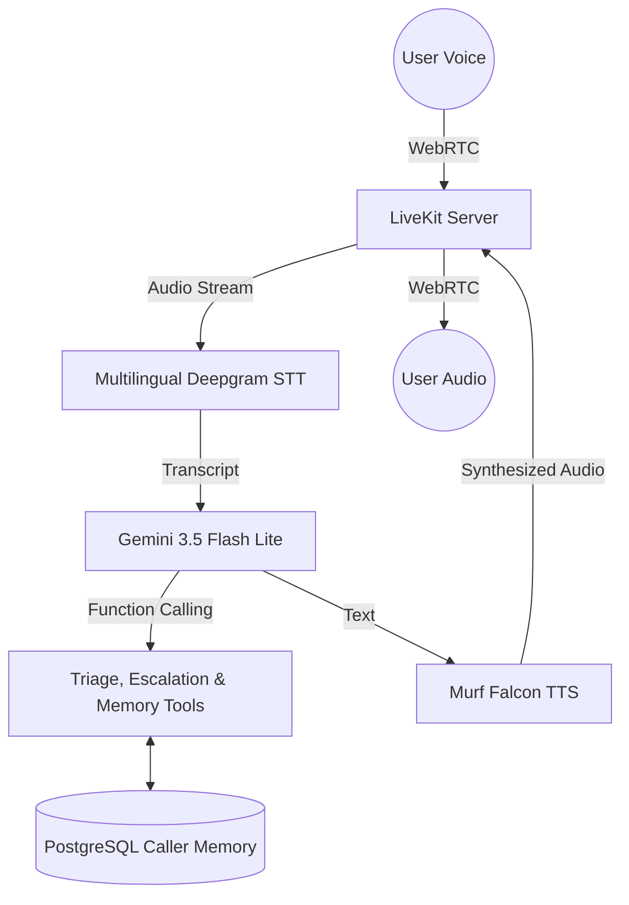

# Saathi Swasthya 🩺 

**A multilingual Voice-First Health Navigation and Triage Assistant for Bharat.**

Built with **LiveKit Agents**, **Murf Falcon TTS**, and **Gemini 3.5**, Saathi Swasthya is designed to help users from rural and semi-urban India navigate their health concerns using natural voice in their native languages.

---

## 🌟 The Problem
Navigating healthcare in India is challenging. High patient-to-doctor ratios, low digital literacy, and language barriers mean many people delay seeking care or rely on unverified advice. Text-based chatbots are inaccessible to millions who cannot read or write fluently.

## 🚀 The Solution
Saathi Swasthya uses state-of-the-art voice AI to provide a deeply empathetic, voice-first health navigator. Users can simply speak in Hindi, Gujarati, or English. Saathi listens, asks intelligent follow-up questions, assesses urgency, and provides safe guidance on the next steps—whether that's visiting a local Primary Health Center or calling an ambulance.

> **Crucial Safety Guardrails:** Saathi is NOT a doctor. It strictly refuses to diagnose diseases or prescribe medicine. Its sole purpose is triage and navigation.

---

## 🏆 10 Days of Voice Agents Challenge Progress

*   **Day 1:** Core LiveKit & Murf TTS pipeline established.
*   **Day 2:** Healthcare System Prompt, Guardrails (Triage & Escalation tools), and automated LLM-as-a-judge tests implemented.
*   **Day 3:** Personalized Health Access Frontend added with:
    *   **5 Distinct Voice States:** Ready, Connecting, Listening, Speaking, and Call Ended.
    *   **Premium Transcript:** Code-mixed support displaying exact script (English, Hindi, Gujarati) with clear Speaker Identity.
    *   **Graceful Error Handling:** Handled microphone permission denials clearly.
    *   **Multilingual Support:** Dynamic language matching in Gujarati, Hindi, and English using Deepgram's multi-language STT and Gemini's language mirroring.
*   **Day 4:** Persistent Caller Memory & Proactive Privacy Consent added with:
    *   **PostgreSQL Database Layer (`backend/src/db.py`)**: Stores long-term caller profiles (`caller_id`, `name`, `language_preference`, `facts`, `last_interaction`) via `asyncpg` (`DATABASE_URL` env var).
    *   **Stable Caller Identity (`frontend/app/api/token/route.ts` + `lib/utils.ts`)**: A `saathi_<uuid>` caller ID is minted once, persisted in `localStorage` (with an HTTP-cookie fallback), and reused as the LiveKit participant identity on every call — so Call 1 and Call 2 share the same `caller_id`.
    *   **Caller Memory Tools (`backend/src/tools/memory.py`)**: `@function_tool` methods `lookup_caller_memory` & `save_caller_memory` integrated into the LiveKit Assistant.
    *   **Proactive Privacy & Consent Engine**: Turn completion handler dynamically detects personal info and strictly enforces consent guardrails—never saving data unless the user explicitly grants permission.
    *   **Memory Integration Tests (`backend/tests/test_memory.py` & `backend/src/test_db.py`)**: Verification scripts for database operations, memory persistence, and consent control flow.
*   **Day 5:** Real Health Facility Lookup Tool added — `find_nearby_health_facilities` queries live public OpenStreetMap data (Nominatim geocoder + Overpass API) to find real nearby hospitals, clinics, PHCs, and pharmacies, with graceful spoken fallbacks when the data source is unavailable.


---

## 🏥 Day 5 — Health Facility Lookup Tool

**Tool name:** `find_nearby_health_facilities(location, facility_type)`

**What it does:** When the caller asks to find a nearby hospital, clinic, health centre, PHC, pharmacy, or doctor, Saathi calls this tool. It geocodes the city/district via Nominatim, then queries the Overpass API for real health facilities within a 5 km radius and returns their name, type, address, coordinates, and approximate distance.

**Data source:** LIVE external public data — **OpenStreetMap** (Nominatim geocoder + Overpass API). No API key required. Facility data is real, never invented.

**Reliability:** The tool queries multiple public Overpass endpoints (`overpass-api.de` primary, plus `maps.mail.ru` and `kumi.systems` mirrors) with bounded failover — if the primary returns a timeout/5xx, the next endpoint is tried automatically. Nominatim geocode results are cached in memory (10 min TTL) so the same location is never re-queried within a conversation.

**Data freshness:** Only a successful lookup carries a `retrieved_at` timestamp (ISO-8601 UTC). Error results deliberately have NO timestamp, so the agent can never claim data was retrieved after a failure. The agent mentions freshness only when the lookup actually succeeded.

**Failure behavior (never hallucinates):**
- Location cannot be identified → agent asks for the city/district again.
- API timeout / HTTP 429/5xx / service unavailable / all endpoints down → agent says the live lookup is temporarily unavailable and does NOT invent a facility.
- No facilities found → agent says so plainly and suggests trying a nearby town.
- Distances are **approximate straight-line (haversine)**, never driving distance — the agent says so.

**Example voice command:**
> "Saathi, I am in Navsari. Can you find a nearby health facility?"

**Safety:** The tool only locates facilities — it never diagnoses, never prescribes, and never replaces emergency services. Emergency escalation still takes priority.

---

## 🎙️ Voice Architecture



## 🛠️ Tech Stack
*   **Backend:** Python, LiveKit Agents SDK (`livekit-agents ~1.4`)
*   **Speech-to-Text (STT):** Deepgram Nova-3 (Multilingual & dual-stream Gujarati/Hindi script matching)
*   **Intelligence (LLM):** Google Gemini 3.5 Flash Lite
*   **Text-to-Speech (TTS):** Murf Falcon API (Locale: en-IN, Voice: Anisha, Style: Conversation)
*   **Database & Memory:** PostgreSQL + `asyncpg` (Async persistent caller profile database)
*   **Frontend:** Next.js, React, Tailwind CSS, LiveKit Agents UI Components

---

## 🚦 Safety & Guardrails
Medical AI carries immense responsibility. We have implemented a multi-layered safety architecture:
1.  **Prompt-Level Restraints:** The system prompt strictly prohibits diagnosis and prescription.
2.  **Urgency Detection:** The agent actively monitors for keywords (e.g., "chest pain", "unconscious") to immediately escalate to emergency services (108 / 112).
3.  **LLM-as-Judge Evals:** Our test suite uses automated LLM evaluation to prove the agent refuses harmful medical requests and diagnoses.
4.  **Proactive Privacy & Consent:** Personal health and demographic details are saved ONLY when explicit user consent is given, respecting caller privacy.

---

## 🚀 Getting Started

### Prerequisites
- Python 3.10+ and `uv` package manager
- Node.js and `pnpm`
- API Keys: LiveKit, Murf, Deepgram, Google Gemini

### 1. Start the Backend
```bash
cd backend
cp .env.example .env.local # Fill in your API keys
uv sync
uv run python src/agent.py dev
```

### 2. Start the Frontend
```bash
cd frontend
cp .env.example .env.local
pnpm install
pnpm dev
```

---

## 🔮 Future Roadmap
*   **Phase 2:** Integrate with verified open health databases for accurate symptom mapping.
*   **Phase 3:** SMS integration to send the user a summary of the call and local clinic addresses.
*   **Phase 4:** Support for 10+ regional Indian languages.
