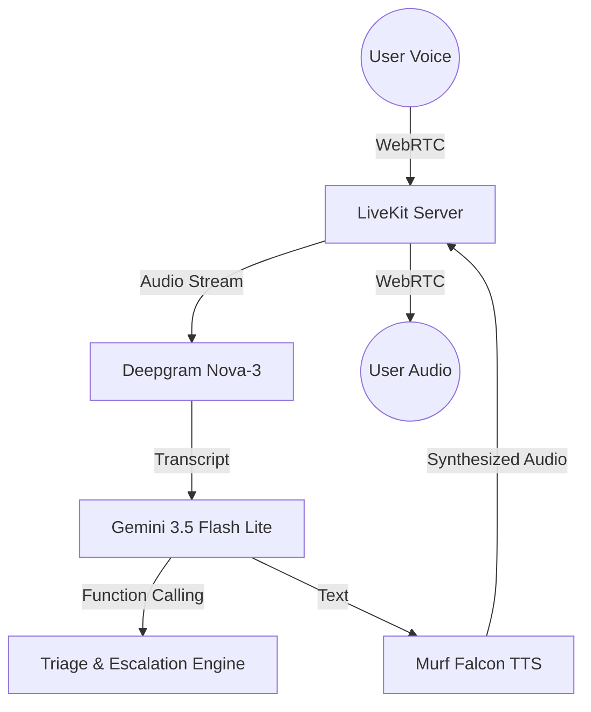

# Saathi Swasthya 🩺 

**A multilingual Voice-First Health Navigation and Triage Assistant for Bharat.**

Built with **LiveKit Agents**, **Murf Falcon TTS**, and **Gemini 3.5**, Saathi Swasthya is designed to help users from rural and semi-urban India navigate their health concerns using natural voice in their native languages.

---

## 🌟 The Problem
Navigating healthcare in India is challenging. High patient-to-doctor ratios, low digital literacy, and language barriers mean many people delay seeking care or rely on unverified advice. Text-based chatbots are inaccessible to millions who cannot read or write fluently.

## 🚀 The Solution
Saathi Swasthya uses state-of-the-art voice AI to provide a deeply empathetic, voice-first health navigator. Users can simply speak in Hindi, Gujarati, or English. Saathi listens, asks intelligent follow-up questions, assesses urgency, and provides safe guidance on the next steps—whether that's visiting a local Primary Health Center or calling an ambulance.

> **Crucial Safety Guardrails:** Saathi is NOT a doctor. It strictly refuses to diagnose diseases or prescribe medicine. Its sole purpose is triage and navigation.

---

## 🎙️ Voice Architecture



## 🛠️ Tech Stack
*   **Backend:** Python, LiveKit Agents SDK
*   **Speech-to-Text (STT):** Deepgram Nova-3 (Multilingual)
*   **Intelligence (LLM):** Google Gemini 3.5 Flash Lite
*   **Text-to-Speech (TTS):** Murf Falcon API (Locale: en-IN, Voice: Anisha)
*   **Frontend:** Next.js, React, TailwindCSS

---

## 🚦 Safety & Guardrails
Medical AI carries immense responsibility. We have implemented a multi-layered safety architecture:
1.  **Prompt-Level Restraints:** The system prompt strictly prohibits diagnosis and prescription.
2.  **Urgency Detection:** The agent actively monitors for keywords (e.g., "chest pain", "unconscious") to immediately escalate to emergency services (108 / 112).
3.  **LLM-as-Judge Evals:** Our test suite uses automated LLM evaluation to prove the agent refuses harmful medical requests and diagnoses.

---

## 🚀 Getting Started

### Prerequisites
- Python 3.10+ and `uv` package manager
- Node.js and `pnpm`
- API Keys: LiveKit, Murf, Deepgram, Google Gemini

### 1. Start the Backend
```bash
cd backend
cp .env.example .env.local # Fill in your API keys
uv sync
uv run python src/agent.py dev
```

### 2. Start the Frontend
```bash
cd frontend
cp .env.example .env.local
pnpm install
pnpm dev
```

---

## 🔮 Future Roadmap
*   **Phase 2:** Integrate with verified open health databases for accurate symptom mapping.
*   **Phase 3:** SMS integration to send the user a summary of the call and local clinic addresses.
*   **Phase 4:** Support for 10+ regional Indian languages.
