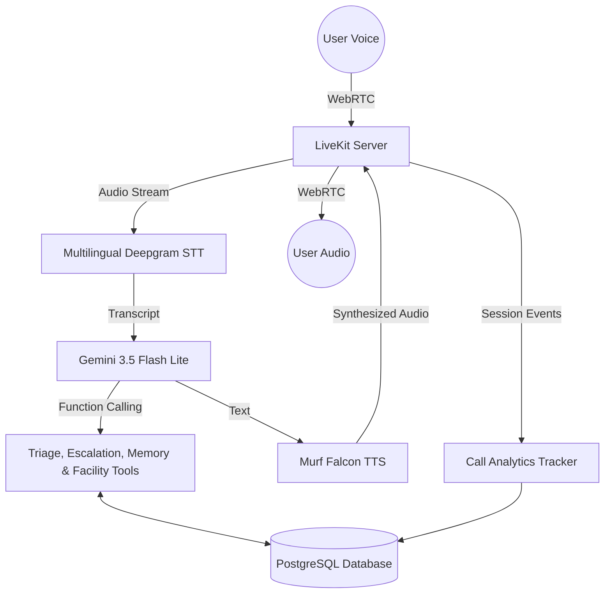

# Saathi Swasthya 🩺 

**A multilingual Voice-First Health Navigation and Triage Assistant for Bharat.**

Built with **LiveKit Agents**, **Murf Falcon TTS**, and **Gemini 3.5**, Saathi Swasthya is designed to help users from rural and semi-urban India navigate their health concerns using natural voice in their native languages.

---

## 🌟 The Problem
Navigating healthcare in India is challenging. High patient-to-doctor ratios, low digital literacy, and language barriers mean many people delay seeking care or rely on unverified advice. Text-based chatbots are inaccessible to millions who cannot read or write fluently.

## 🚀 The Solution
Saathi Swasthya uses state-of-the-art voice AI to provide a deeply empathetic, voice-first health navigator. Users can simply speak in Hindi, Gujarati, or English. Saathi listens, asks intelligent follow-up questions, assesses urgency, and provides safe guidance on the next steps—whether that's visiting a local Primary Health Center or calling an ambulance.

> **Crucial Safety Guardrails:** Saathi is NOT a doctor. It strictly refuses to diagnose diseases or prescribe medicine. Its sole purpose is triage and navigation.

---

## 🏆 10 Days of Voice Agents Challenge Progress

*   **Day 1:** Core LiveKit & Murf TTS pipeline established.
*   **Day 2:** Healthcare System Prompt, Guardrails (Triage & Escalation tools), and automated LLM-as-a-judge tests implemented.
*   **Day 3:** Personalized Health Access Frontend added with:
    *   **5 Distinct Voice States:** Ready, Connecting, Listening, Speaking, and Call Ended.
    *   **Premium Transcript:** Code-mixed support displaying exact script (English, Hindi, Gujarati) with clear Speaker Identity.
    *   **Graceful Error Handling:** Handled microphone permission denials clearly.
    *   **Multilingual Support:** Dynamic language matching in Gujarati, Hindi, and English using Deepgram's multi-language STT and Gemini's language mirroring.
*   **Day 4:** Persistent Caller Memory & Proactive Privacy Consent added with:
    *   **PostgreSQL Database Layer (`backend/src/db.py`)**: Stores long-term caller profiles (`caller_id`, `name`, `language_preference`, `facts`, `last_interaction`) via `asyncpg` (`DATABASE_URL` env var).
    *   **Stable Caller Identity (`frontend/app/api/token/route.ts` + `lib/utils.ts`)**: A `saathi_<uuid>` caller ID is minted once, persisted in `localStorage` (with an HTTP-cookie fallback), and reused as the LiveKit participant identity on every call — so Call 1 and Call 2 share the same `caller_id`.
    *   **Caller Memory Tools (`backend/src/tools/memory.py`)**: `@function_tool` methods `lookup_caller_memory` & `save_caller_memory` integrated into the LiveKit Assistant.
    *   **Proactive Privacy & Consent Engine**: Turn completion handler dynamically detects personal info and strictly enforces consent guardrails—never saving data unless the user explicitly grants permission.
    *   **Memory Integration Tests (`backend/tests/test_memory.py` & `backend/src/test_db.py`)**: Verification scripts for database operations, memory persistence, and consent control flow.
*   **Day 5:** Real Health Facility Lookup Tool added — `find_nearby_health_facilities` queries live public OpenStreetMap data (Nominatim geocoder + Overpass API) to find real nearby hospitals, clinics, PHCs, and pharmacies, with graceful spoken fallbacks when the data source is unavailable.
*   **Day 6:** Outbound Telephony & Follow-Up Agent added with:
    *   **Agent-Initiated Outbound Calling (`backend/src/telephony/outbound/dial.py`)**: Uses LiveKit SIP Outbound Trunk (`LIVEKIT_SIP_OUTBOUND_TRUNK_ID`) to dial softphones (e.g. Linphone) or PSTN endpoints.
    *   **Dedicated Outbound Worker (`backend/src/telephony/outbound/agent.py`)**: Registers `saathi-outbound` agent, introducing itself safely (identity, purpose, explicit opt-out consent).
    *   **Destination Normalization**: Handles bare usernames, phone numbers (E.164), and full SIP URIs, extracting clean SIP user targets for LiveKit's `sip_call_to`.
    *   **Multilingual Script & Guardrail Control**: Supports English, Hindi (Devanagari), and Gujarati (Gujarati script) without medical diagnosis or unauthorized recording.
    *   **Comprehensive Test Suite (`backend/tests/test_outbound.py`)**: Automated verification for destination normalization, safety prompt constraints, agent-name parity, defensive SIP status logging, and env readiness.
*   **Day 7:** Human-Help Escalation Engine added with:
    *   **Escalation Tool (`create_escalation`)**: Function tool for creating structured support tickets when human intervention is needed.
    *   **Consent-Gated Persistence**: The tool fails closed — `consent_confirmed is not True` means no database call and no row, whatever the caller said. Records land in the PostgreSQL `escalation_requests` table.
    *   **Reference Code Generation**: Assigns unique tracking IDs of the form `ESC-XXXXXXXX` (eight uppercase hex characters from `secrets.token_hex(4)`, e.g. `ESC-9F3A2B7C`) and stores a short `what_happened` summary, the agent's action, urgency, language, and an optional preferred follow-up window. Contact numbers, transcripts, OTPs and PINs are never stored.
    *   **Urgency Guardrails & Evals**: Urgency classification (`low`, `medium`, `high`, `emergency`) with safety instructions for immediate emergency calls (108/112) on high-risk cases.
*   **Day 8:** Voice Call Outcome Analytics & Admin Dashboard added with:
    *   **Deterministic Outcome Tracker (`backend/src/analytics.py`)**: `CallAnalyticsTracker` monitors session events (`function_tools_executed`, `conversation_item_added`, `close`) to evaluate outcomes strictly from application state without probabilistic LLM judgment.
    *   **Fail-Soft Telemetry**: Exception-guarded async database writes guarantee that analytics failures will never block or delay live voice streams.
    *   **PostgreSQL Analytics Store (`backend/src/db.py`)**: Logs session metadata, outcome (`success` / `failed`), success type (`guidance` / `escalation`), failure reason (`error`, `no_response`, `no_success_condition`), duration, channel (`browser` / `sip`), and language.
    *   **Next.js API & Admin Analytics Dashboard (`/dashboard`)**: Reads real rows from PostgreSQL through `frontend/app/api/analytics/route.ts` and renders four KPI cards (total calls, successful, failed, success rate), a success-rate bar, and the 8 most recent calls with start time, channel, duration and outcome. Polls every 8 seconds, contains no mock or hardcoded numbers, and returns a clear `analytics_unavailable` state when the database is unreachable.
*   **Day 9:** Clinic & Appointment Specialist Agent (Multi-Agent Handoff) added with:
    *   **Dedicated Specialist (`backend/src/prompts/clinic_specialist.py`)**: A focused sub-agent (`ClinicAppointmentSpecialist`) that handles only healthcare facility (hospitals, clinics, pharmacies) and appointment assistance.
    *   **Agent Handoff (`backend/src/agent.py`)**: Main Saathi agent uses the `transfer_to_clinic_specialist` tool to seamlessly transfer the caller when they need facility or appointment help, preserving the conversation context.
    *   **Language Continuity**: Advanced language tracking prevents the agent from flipping languages on short or mixed-script turns, ensuring a consistent multilingual experience across handoffs.
    *   **Test Coverage**: 145 collected tests across agent e2e evals, multilingual language handling, memory persistence, outbound SIP, human escalation, and deterministic analytics. Latest full local run (2026-08-14): **135 passed, 3 skipped, 7 failed**. The 3 skips are the opt-in live-network OpenStreetMap tests (`RUN_LIVE_TESTS=1`). Of the 7 failures, 4 were Gemini free-tier rate limits (15 requests/minute on `gemini-3.5-flash-lite`), 2 were LLM-judge evals in `test_multilingual.py`, and 1 was LLM-judge variance that passes on its own. See **Testing & Known Limitations** below.


---

## 🏥 Day 5 — Health Facility Lookup Tool

**Tool name:** `find_nearby_health_facilities(location, facility_type)`

**What it does:** When the caller asks to find a nearby hospital, clinic, health centre, PHC, pharmacy, or doctor, Saathi calls this tool. It geocodes the city/district via Nominatim, then queries the Overpass API for real health facilities within a 5 km radius and returns their name, type, address, coordinates, and approximate distance.

**Data source:** LIVE external public data — **OpenStreetMap** (Nominatim geocoder + Overpass API). No API key required. Facility data is real, never invented.

**Reliability:** The tool queries multiple public Overpass endpoints (`overpass-api.de` primary, plus `maps.mail.ru` and `kumi.systems` mirrors) with bounded failover — if the primary returns a timeout/5xx, the next endpoint is tried automatically. Nominatim geocode results are cached in memory (10 min TTL) so the same location is never re-queried within a conversation.

**Data freshness:** Only a successful lookup carries a `retrieved_at` timestamp (ISO-8601 UTC). Error results deliberately have NO timestamp, so the agent can never claim data was retrieved after a failure. The agent mentions freshness only when the lookup actually succeeded.

**Failure behavior (never hallucinates):**
- Location cannot be identified → agent asks for the city/district again.
- API timeout / HTTP 429/5xx / service unavailable / all endpoints down → agent says the live lookup is temporarily unavailable and does NOT invent a facility.
- No facilities found → agent says so plainly and suggests trying a nearby town.
- Distances are **approximate straight-line (haversine)**, never driving distance — the agent says so.

**Example voice command:**
> "Saathi, I am in Navsari. Can you find a nearby health facility?"

**Safety:** The tool only locates facilities — it never diagnoses, never prescribes, and never replaces emergency services. Emergency escalation still takes priority.

---

## 📞 Day 6 — Outbound Telephony & Follow-Up Agent

**Components:**
- `backend/src/telephony/outbound/dial.py`: Dispatcher script that triggers LiveKit agent dispatch to a specified callee.
- `backend/src/telephony/outbound/agent.py`: Dedicated outbound worker process (`saathi-outbound`) handling the SIP call lifecycle, opening greetings, and interactive dialog.
- `backend/tests/test_outbound.py`: Comprehensive test suite verifying SIP user normalization, prompt safety, agent name alignment, and defensive failure logging.

**How Outbound Works:**
1. **Trigger Call**: Execute `uv run python src/telephony/outbound/dial.py --to <username_or_phone>`
2. **Dispatch Agent**: LiveKit server dispatches the `saathi-outbound` worker into a dedicated room with destination metadata.
3. **SIP Connection**: The worker creates a SIP participant via the configured LiveKit outbound SIP trunk (`LIVEKIT_SIP_OUTBOUND_TRUNK_ID`).
4. **Greeting & Opt-Out**: Once the callee answers and joins, Saathi introduces itself, explains why it's calling, and informs the caller they can ask to stop at any time.
5. **Interactive Navigation**: Supports multilingual interaction in Hindi, Gujarati, and English with script enforcement.
6. **Graceful Disconnect**: The session automatically terminates when the participant hangs up or requests to stop.

**Running Outbound Calls:**
```bash
# Terminal 1: Start outbound worker
cd backend
uv run python src/telephony/outbound/agent.py dev

# Terminal 2: Dial Linphone user or phone number
cd backend
uv run python src/telephony/outbound/dial.py --to <linphone_user_or_phone>
```

---

## 🤝 Day 7 — Human-Help Escalation Engine

**Components:**
- `backend/src/tools/human_escalation.py`: `@function_tool` implementation for `create_escalation`.
- `backend/src/db.py`: `create_escalation_ticket()` database helper creating records in the `escalation_requests` table.
- `backend/tests/test_human_escalation.py` & `test_escalation_db.py`: Test suite verifying consent checks, ticket format, and DB persistence.

**How Escalation Works:**
1. **Trigger**: Caller asks to talk to a human healthcare worker, nurse, or doctor.
2. **Consent Request**: Saathi explicitly requests caller consent to save their contact details for a callback.
3. **Ticket Creation**: Only after an explicit caller "yes", `create_escalation` is called with (`user_id`, `reason`, `what_happened`, `agent_action`, `urgency`, `language`, `preferred_follow_up`, `consent_confirmed=True`).
4. **Reference Code**: A unique code of the form `ESC-XXXXXXXX` (e.g. `ESC-9F3A2B7C`) is generated and spoken back to the caller for tracking.
5. **Emergency Handling**: If urgency is classified as `emergency` or `high`, Saathi immediately instructs the caller to dial emergency services (108 / 112) in addition to creating the ticket.

---

## 📊 Day 8 — Call Analytics & Admin Dashboard

**Components:**
- `backend/src/analytics.py`: `CallAnalyticsTracker` session wire and deterministic resolution module.
- `backend/src/db.py`: PostgreSQL schema definition and functions for `call_analytics` table.
- `frontend/app/api/analytics/route.ts`: Next.js REST API serving real aggregated call metrics.
- `frontend/components/app/analytics-dashboard.tsx`: Interactive admin analytics dashboard component.
- `frontend/app/dashboard/page.tsx`: `/dashboard` route for viewing platform performance.
- `backend/tests/test_analytics.py`: 37 tests validating deterministic outcome logic and fail-soft wrappers.

**Deterministic Success & Failure Criteria:**
Outcome evaluation relies strictly on application events (never LLM evaluations):
- **Success (`escalation`)**: Successful execution of `create_escalation` with a valid reference ID.
- **Success (`guidance`)**: Successful execution of `find_nearby_health_facilities` (returning status "ok"), `analyze_symptoms`, `find_emergency_contact`, or a substantive assistant response (≥ 20 chars) following a user message.
- **Failure**: Handled session error (`error`), no user interaction (`no_response`), or disconnect prior to satisfying a success condition (`no_success_condition`).

**Accessing the Dashboard:**
Navigate to `http://localhost:3000/dashboard` or click the **Analytics** button in the header of the web application.

---

## 🏥 Day 9 — Clinic & Appointment Specialist (Multi-Agent)

**Components:**
- `backend/src/prompts/clinic_specialist.py`: The specialized system prompt for the `ClinicAppointmentSpecialist` agent.
- `backend/src/agent.py`: Implementation of `transfer_to_clinic_specialist` handoff tool and the specialist agent class.
- `backend/src/prompts/saathi_system.py`: Updated main agent prompt to instruct when to hand off.

**How the Specialist Works:**
1. **Trigger**: Caller asks for help finding a hospital, clinic, pharmacy, or needs help with appointments, hours, or facility navigation.
2. **Handoff**: The main Saathi agent calls the `transfer_to_clinic_specialist` tool. LiveKit gracefully pauses the main agent, announces the transfer in the caller's established language (e.g., "I'm connecting you to our clinic and appointment specialist."), and wakes up the specialist agent.
3. **Context Preservation**: The new agent receives the full `chat_ctx` from the main agent, so it already knows the caller's location and request. The caller never has to repeat themselves.
4. **Specialized Assistance**: The new agent is explicitly instructed *not* to act as a general health assistant (no symptom analysis). It strictly helps with facility lookup (via the `find_nearby_health_facilities` tool) and appointment guidance.
5. **Language Continuity**: The handoff system tracks the `_last_detected_language` to ensure the new agent starts speaking in the exact same language (Hindi, Gujarati, English) that the caller was already using.

---

## 🎙️ Voice Architecture



## 🛠️ Tech Stack
*   **Backend:** Python 3.10+, LiveKit Agents SDK (`livekit-agents ~1.4`)
*   **Speech-to-Text (STT):** Deepgram Nova-3 (Multilingual & dual-stream Gujarati/Hindi script matching)
*   **Intelligence (LLM):** Google Gemini 3.5 Flash Lite
*   **Text-to-Speech (TTS):** Murf Falcon API (Voice: Anisha, Style: Conversation, sentence-level streaming with text pacing)
*   **Database & Analytics:** PostgreSQL + `asyncpg` (Backend), `pg` connection pool (Frontend API)
*   **Frontend & Dashboard:** Next.js 15, React 19, Tailwind CSS, Lucide React, LiveKit Agents UI
*   **Testing:** Pytest (145 collected unit, DB & LLM-as-a-judge tests), Ruff, ESLint

---

## 🚦 Safety & Guardrails
Medical AI carries immense responsibility. We have implemented a multi-layered safety architecture:
1.  **Prompt-Level Restraints:** The system prompt strictly prohibits diagnosis and prescription.
2.  **Urgency Detection:** The agent actively monitors for keywords (e.g., "chest pain", "unconscious") to immediately escalate to emergency services (108 / 112).
3.  **LLM-as-Judge Evals:** Our test suite uses automated LLM evaluation to prove the agent refuses harmful medical requests and diagnoses.
4.  **Proactive Privacy & Consent:** Personal health and demographic details are saved ONLY when explicit user consent is given, respecting caller privacy.
5.  **LLM-Free Analytics:** Call outcomes are evaluated deterministically from runtime tool and message events—never using LLMs to grade metrics or store sensitive user conversations.

---

## 🚀 Getting Started

### Prerequisites
- Python 3.10+ and `uv` package manager
- Node.js and `pnpm`
- PostgreSQL database (`DATABASE_URL` env var)
- API Keys: LiveKit, Murf, Deepgram, Google Gemini

### 1. Start the Backend
```bash
cd backend
cp .env.example .env.local # Fill in your API keys & DATABASE_URL
uv sync
uv run python src/agent.py dev
```

### 2. Start the Frontend
```bash
cd frontend
cp .env.example .env.local
pnpm install
pnpm dev
```

### 3. Run Tests
```bash
# Run the backend test suite (145 collected tests)
cd backend
uv run pytest -q

# Lint & format check
uv run ruff check .
uv run ruff format --check .

# Opt in to the live-network OpenStreetMap tests (3 tests, skipped by default)
RUN_LIVE_TESTS=1 uv run pytest tests/test_health_access_live.py -v

# Run frontend linters
cd frontend
pnpm lint
```

---

## 🧪 Testing & Known Limitations

**Latest full local run (2026-08-14): 145 collected — 135 passed, 3 skipped, 7 failed.**

The suite mixes three kinds of tests: pure unit tests (no network), database tests that need a reachable `DATABASE_URL`, and LLM-as-a-judge evals that need live model credentials. Those last two categories make the suite environment-dependent, and that is the honest state of it:

*   **Rate limits, not defects.** 4 of the 7 failures (`test_1_gujarati`, `test_3_english`, `test_4_english_to_gujarati`, `test_10_rapid_switching`) hit the Gemini free-tier quota — `GenerateRequestsPerMinutePerProjectPerModel-FreeTier`, 15 requests/minute on `gemini-3.5-flash-lite`. After LiveKit exhausts its retries the generation dies, so the assertion surfaces as the misleading `Expected another event, but none left`. Running `tests/test_multilingual.py` on its own, or on a paid tier, is the workaround.
*   **LLM-judge variance.** `test_agent.py::test_handoff_failure_does_not_crash` failed in the full run and passes on its own. Its structural assertion (no handoff occurs when specialist construction is forced to fail) passed both times; only the judge's opinion of the wording differed.
*   **An eval-harness gap worth knowing about.** `AgentSession.run(user_input=...)` calls `generate_reply()` directly, so `Agent.on_user_turn_completed` — which is only invoked on the audio/STT path — never fires during these tests. That means the per-turn injection layer (language instruction, language continuity, consent rules, escalation rules, caller memory) is **not** exercised by `test_multilingual.py`; those tests measure how well the model mirrors language from the system prompt alone. This explains the two remaining failures: `test_5_gujarati_to_english` never receives the English instruction the live agent would inject, and `test_8_code_mixed_gujarati` asks the judge for code-mixed English words while `saathi_system.py` mandates replying in the caller's own script. The continuity layer itself is covered by pure unit tests in `test_agent.py`, which pass.
*   **CI is partial.** `.github/workflows/tests.yml` supplies the LiveKit secrets only, so the Gemini-backed evals cannot pass there as written.

**Not implemented (stated plainly so nothing is oversold):** Saathi does **not** book appointments. The Clinic & Appointment Specialist explains what to bring, what to ask, and how booking generally works, and is explicitly instructed to admit it cannot see real availability and to tell the caller to contact the facility directly. There is no booking API, and the `/dashboard` and `/api/analytics` routes currently have no authentication — run them locally or put your own auth in front of them before exposing them.

---

## 🔮 Future Roadmap
*   **Phase 2:** Integrate with verified open health databases for accurate symptom mapping.
*   **Phase 3:** SMS integration to send the user a summary of the call and local clinic addresses.
*   **Phase 4:** Support for 10+ regional Indian languages.

