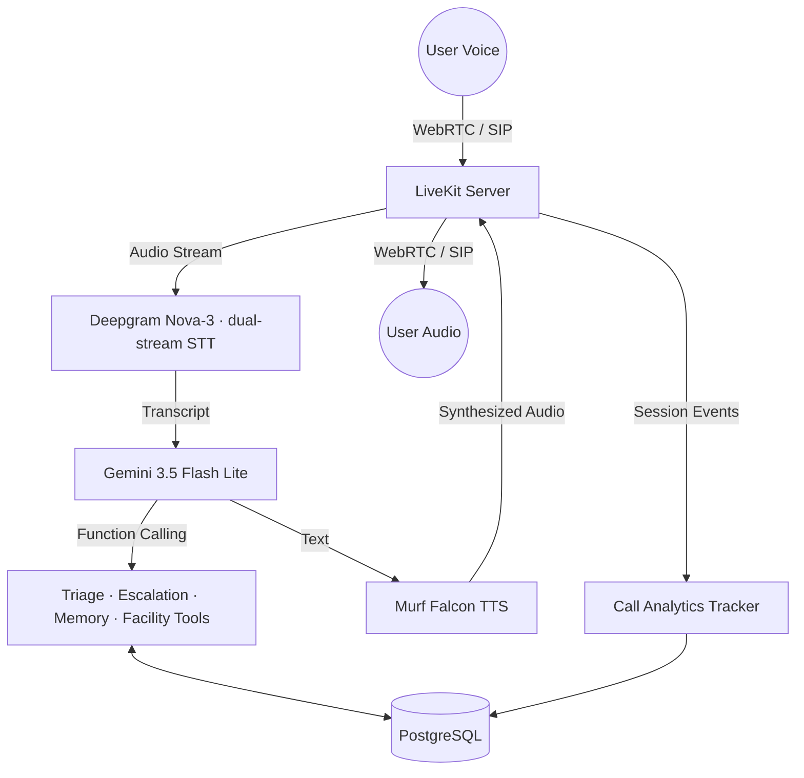

# Saathi Swasthya 🩺

**A multilingual, voice-first health navigation and triage assistant for Bharat.**

Built with **LiveKit Agents**, **Deepgram Nova-3**, **Google Gemini 3.5 Flash Lite**, and **Murf Falcon TTS**, Saathi Swasthya helps people in rural and semi-urban India navigate their health concerns by voice, in their own language — Hindi, Gujarati, or English.

> Built for the **Murf AI "10 Days of Voice Agents — VoiceForBharat Edition"** challenge (Health Access track).

---

## 🌟 The Problem

Navigating healthcare in India is hard. High patient-to-doctor ratios, low digital literacy, and language barriers mean many people delay care or rely on unverified advice. Text chatbots are useless to the millions who cannot read or write fluently. People navigate health by *voice*, in their own language, usually through whoever is nearest.

## 🚀 The Solution

Saathi is a voice-first navigator. You speak; it listens, asks intelligent follow-up questions, assesses how urgent your situation sounds, points you to real nearby facilities, and — with your permission — passes a short summary to a human. It fits the way people already behave instead of fighting it.

> **Safety first — Saathi is NOT a doctor.** It strictly refuses to diagnose diseases, prescribe medicine, or rank hospitals by quality. It does not book appointments. Its sole purpose is triage and navigation, and every one of those refusals is written into the prompt and tested.

---

## 🎙️ How It Works



A deterministic layer inside `on_user_turn_completed` decides the language, the consent state, and whether a red-flag symptom fired **in Python** on every turn, then hands those decisions to the LLM as non-negotiable instructions. Anything that could be decided in code is decided in code.

## 🛠️ Tech Stack

*   **Backend:** Python 3.10+, LiveKit Agents SDK (`livekit-agents ~1.4`), managed with `uv`
*   **Speech-to-Text:** Deepgram Nova-3 (dual-stream `multi` + `gu` for code-mixed speech)
*   **LLM:** Google Gemini 3.5 Flash Lite
*   **Text-to-Speech:** Murf Falcon API (voice: Anisha, style: Conversation, sentence-level streaming with text pacing)
*   **Turn-taking:** Silero VAD + LiveKit multilingual turn detector, preemptive generation
*   **Database:** PostgreSQL + `asyncpg` (backend), `pg` connection pool (frontend API)
*   **Frontend & Dashboard:** Next.js 15, React 19, Tailwind CSS, Lucide React, LiveKit Agents UI
*   **Testing:** Pytest (145 collected — unit, DB & LLM-as-a-judge), Ruff, ESLint

---

## 🗓️ The 10-Day Build

Each day below is covered once. Days ran 06–14 Aug 2026, with Day 10 the write-up.

### Day 1 — Core voice pipeline

Established the real-time pipeline that stayed for all ten days: LiveKit Agents for transport, Deepgram Nova-3 for STT, Gemini 3.5 Flash Lite for reasoning, and Murf Falcon for the voice. Falcon is configured with `SentenceTokenizer(min_sentence_len=2)` and `text_pacing=True`, so it starts speaking after a couple of sentences instead of waiting for the full completion, and `preemptive_generation=True` lets the LLM start before the turn is formally closed. In a voice product, *when* the voice starts matters as much as the voice itself.

### Day 2 — Healthcare prompt & guardrails

*   The system prompt refuses to diagnose, refuses to prescribe, and refuses to name the "best" hospital. Red-flag symptoms (chest pain, unconsciousness) point at **112 and 108** before anything else.
*   Refusals are written as fixed scripts, because an agent that improvises its own refusal wording eventually improvises its way around it.
*   Automated **LLM-as-a-judge** tests check that the agent holds those refusals.

### Day 3 — Health Access frontend

*   **Voice states** surfaced in the UI: Ready, Connecting, Listening, Speaking, and Call Ended.
*   **Transcript** renders the exact script as spoken (English, Devanagari, Gujarati) with clear speaker identity, and supports code-mixed lines.
*   **Graceful microphone handling** — a clear message when the browser denies mic permission, the single most common way a voice app fails for a real user.
*   **Multilingual matching** across Gujarati, Hindi, and English via Deepgram's multi-language STT and Gemini's language mirroring.

### Day 4 — Persistent memory & proactive consent

*   **PostgreSQL layer (`backend/src/db.py`)** stores long-term caller profiles (`user_id`, `name`, `language_preference`, `facts`, `last_interaction`) via `asyncpg` (`DATABASE_URL`).
*   **Stable caller identity (`frontend/app/api/token/route.ts` + `lib/utils.ts`)** — a `saathi_<uuid>` caller ID is minted once, kept in `localStorage` with a cookie fallback, and reused as the LiveKit participant identity, so Call 1 and Call 2 are the same person.
*   **Memory tools (`backend/src/tools/memory.py`)** — `@function_tool` methods `lookup_caller_memory` and `save_caller_memory`.
*   **Consent engine** — the write path **fails closed**: `consent_confirmed is not True` means no database call and no row, whatever the caller said. Credentials, OTPs, PINs and transcripts are never stored.
*   **Tests:** `backend/tests/test_memory.py`, `backend/src/test_db.py`.

### Day 5 — Real health-facility lookup

Tool: `find_nearby_health_facilities(location, facility_type)`. When a caller asks for a nearby hospital, clinic, health centre, PHC, pharmacy, or doctor, Saathi geocodes the city/district via **Nominatim**, then queries the **Overpass API** for real facilities within a 5 km radius and returns name, type, address, coordinates, and approximate distance.

*   **Data source:** live public **OpenStreetMap** data — no API key, never invented.
*   **Reliability:** three public Overpass endpoints (`overpass-api.de` primary, `maps.mail.ru` and `kumi.systems` mirrors) with bounded failover; Nominatim geocodes cached in memory (10 min TTL) so the same town is never re-queried in one conversation.
*   **Freshness:** only a *successful* lookup carries a `retrieved_at` timestamp (ISO-8601 UTC). Error results deliberately have none, so the agent can never claim it fetched fresh data after a failure.
*   **Never hallucinates:** location not identified → asks again; timeout/429/5xx/all endpoints down → says the live lookup is temporarily unavailable and invents nothing; no results → says so and suggests a nearby town.
*   **Distances** are approximate straight-line (haversine), never driving distance — and the agent says "approximately" out loud.

### Day 6 — Outbound telephony & follow-up agent

A dedicated outbound worker (`saathi-outbound`) can dial a softphone or PSTN endpoint through a LiveKit SIP trunk, introduce itself, state why it's calling, and tell the person they can stop at any time.

*   **Dispatcher (`backend/src/telephony/outbound/dial.py`)** triggers agent dispatch to a callee.
*   **Worker (`backend/src/telephony/outbound/agent.py`)** handles the SIP call lifecycle, greeting, and dialog.
*   **Destination normalization** for bare usernames, E.164 numbers, and full SIP URIs into the SIP user `sip_call_to` expects; SIP failures are logged with their `sip_status_code`.
*   **Tests:** `backend/tests/test_outbound.py` covers normalization, prompt safety, agent-name parity, and defensive logging.

```bash
# Terminal 1 — start the outbound worker
cd backend
uv run python src/telephony/outbound/agent.py dev

# Terminal 2 — dial a softphone user or phone number
uv run python src/telephony/outbound/dial.py --to <linphone_user_or_phone>
```

### Day 7 — Human-help escalation

Some conversations should not end with an AI. On a red-flag symptom, or a request to talk to a human, Saathi gives the emergency guidance first, then offers to pass a short summary to a human — and asks permission.

*   **Tool `create_escalation` (`backend/src/tools/human_escalation.py`)** creates a structured support ticket.
*   **Consent-gated & fail-closed** — `consent_confirmed is not True` means no DB call and no row. Records land in the PostgreSQL `escalation_requests` table via `create_escalation_ticket()`.
*   **Reference code** of the form `ESC-XXXXXXXX` (eight uppercase hex characters from `secrets.token_hex(4)`, e.g. `ESC-9F3A2B7C`), read back to the caller. Stored fields: a short `what_happened` summary, the agent's action, urgency, language, and an optional preferred follow-up window. Contact numbers, transcripts, OTPs and PINs are never stored.
*   **Urgency classes** (`low`, `medium`, `high`, `emergency`) — on `high`/`emergency` the caller is told to dial 108/112 in addition to the ticket.
*   **Tests:** `backend/tests/test_human_escalation.py`, `test_escalation_db.py`.

### Day 8 — Call analytics & admin dashboard

Outcomes are decided by application state, not by an LLM grading itself.

*   **Deterministic tracker (`backend/src/analytics.py`)** — `CallAnalyticsTracker` listens to session events (`function_tools_executed`, `conversation_item_added`, `close`) and resolves an outcome from fixed conditions: escalation created → substantive guidance given → error → no response → no success condition met.
*   **Fail-soft telemetry** — every DB write is exception-guarded, so analytics can never block or delay a live voice stream.
*   **PostgreSQL store (`call_analytics`)** logs minimal metadata: opaque caller id, channel (`browser`/`sip`), start/end timestamps, duration, outcome (`success`/`failed`), success type (`guidance`/`escalation`), failure reason (`error`, `no_response`, `no_success_condition`). The schema also defines a `language` column, though the tracker does not currently populate it. No transcripts, medical details, or credentials are stored.
*   **Dashboard (`/dashboard`)** reads real rows through `frontend/app/api/analytics/route.ts` and renders four KPI cards (total, successful, failed, success rate), a success-rate bar, and the 8 most recent calls. Polls every 8 seconds, contains no mock numbers, and shows a clear `analytics_unavailable` state when the DB is unreachable.
*   **Tests:** `backend/tests/test_analytics.py` (37 tests).

> **Note:** `/dashboard` and `/api/analytics` currently have **no authentication**. Keep them local, or put your own auth in front of them before exposing them.

### Day 9 — Clinic & Appointment Specialist (multi-agent handoff)

Exactly **one** specialist, added only because it has a boundary the main agent cannot hold.

*   **Specialist (`backend/src/prompts/clinic_specialist.py`)** — `ClinicAppointmentSpecialist` handles only facility (hospitals, clinics, pharmacies) and appointment help.
*   **Handoff (`backend/src/agent.py`)** — the main agent calls `transfer_to_clinic_specialist`, which pauses it, announces the transfer in the caller's established language, and wakes the specialist. Context is passed with the main agent's instructions excluded, so the caller never repeats their location or problem.
*   **No booking.** It explains what to bring, what to ask, and how booking generally works, and is instructed to admit it cannot see real availability and to tell the caller to contact the facility directly. There is no booking API.
*   **Language continuity** — the last detected language carries across the handoff, so the specialist starts in the same language (Hindi, Gujarati, English).
*   **Test coverage:** 145 collected tests across agent e2e evals, multilingual handling, memory, outbound SIP, escalation, and analytics. Latest full local run (2026-08-14): **135 passed, 3 skipped, 7 failed** — details below.

---

## 🚦 Safety & Guardrails

1.  **Prompt-level restraints** — the system prompt strictly prohibits diagnosis and prescription.
2.  **Urgency detection** — keywords such as "chest pain" or "unconscious" escalate to 108/112 immediately.
3.  **LLM-as-judge evals** — automated tests check that the agent refuses harmful medical requests.
4.  **Proactive privacy & consent** — personal details are saved only on explicit consent; the write path fails closed.
5.  **LLM-free analytics** — outcomes are graded deterministically from runtime events, never by an LLM, and no conversations are stored.

---

## 🚀 Getting Started

**Prerequisites:** Python 3.10+ and `uv`, Node.js and `pnpm`, a reachable PostgreSQL instance, and API keys for LiveKit, Murf, Deepgram, and Google Gemini.

```bash
# 1. Backend
cd backend
cp .env.example .env.local     # fill in your API keys & DATABASE_URL
uv sync
uv run python src/agent.py dev

# 2. Frontend (separate terminal)
cd frontend
cp .env.example .env.local
pnpm install
pnpm dev                       # http://localhost:3000
```

Database tables (`caller_memory`, `escalation_requests`, `call_analytics`) are created automatically on startup — no manual SQL step.

```bash
# 3. Tests & lint
cd backend
uv run pytest -q
uv run ruff check .
uv run ruff format --check .
RUN_LIVE_TESTS=1 uv run pytest tests/test_health_access_live.py -v   # opt-in, hits live OSM
cd ../frontend && pnpm lint
```

---

## 🧪 Testing & Known Limitations

**Latest full local run (2026-08-14): 145 collected — 135 passed, 3 skipped, 7 failed.**

The suite mixes pure unit tests, DB tests that need a reachable `DATABASE_URL`, and LLM-as-a-judge evals that need live model credentials. That makes it environment-dependent, and here is the honest state of it — none of the 7 failures is a defect in the voice agent:

*   **Rate limits, not defects.** 4 failures (`test_1_gujarati`, `test_3_english`, `test_4_english_to_gujarati`, `test_10_rapid_switching`) hit the Gemini free-tier quota — `GenerateRequestsPerMinutePerProjectPerModel-FreeTier`, 15 requests/minute on `gemini-3.5-flash-lite`. After retries are exhausted the generation dies, so the assertion surfaces as the misleading `Expected another event, but none left`. Running `tests/test_multilingual.py` alone, or on a paid tier, is the workaround.
*   **LLM-judge variance.** `test_agent.py::test_handoff_failure_does_not_crash` failed in the full run and passes on its own. Its structural assertion (no handoff occurs when specialist construction is forced to fail) passed both times; only the judge's opinion of the wording differed.
*   **An eval-harness gap worth knowing about.** `AgentSession.run(user_input=...)` calls `generate_reply()` directly, so `Agent.on_user_turn_completed` — which only fires on the audio/STT path — never runs during these tests. The per-turn injection layer (language instruction, language continuity, consent, escalation, caller memory) is therefore **not** exercised by `test_multilingual.py`; those tests measure how well the model mirrors language from the system prompt alone. This explains the last two failures: `test_5_gujarati_to_english` never receives the English instruction the live agent would inject, and `test_8_code_mixed_gujarati` asks the judge for code-mixed English words while `saathi_system.py` mandates replying in the caller's own script. The continuity layer itself is covered by pure unit tests in `test_agent.py`, which pass.
*   **CI is partial.** `.github/workflows/tests.yml` supplies the LiveKit secrets only, so the Gemini-backed evals cannot pass there as written.

**Not implemented (stated plainly, so nothing is oversold):** Saathi does **not** book appointments — there is no booking API. The `/dashboard` and `/api/analytics` routes have no authentication. The `call_analytics.language` column is defined but not populated. These are known gaps, written down rather than hidden.

---

## 🔮 Future Roadmap

*   Integrate verified open health databases for more accurate symptom mapping.
*   SMS follow-up with a call summary and local clinic addresses.
*   Support for 10+ regional Indian languages.
*   Authentication in front of the dashboard and analytics API before any networked deployment.
